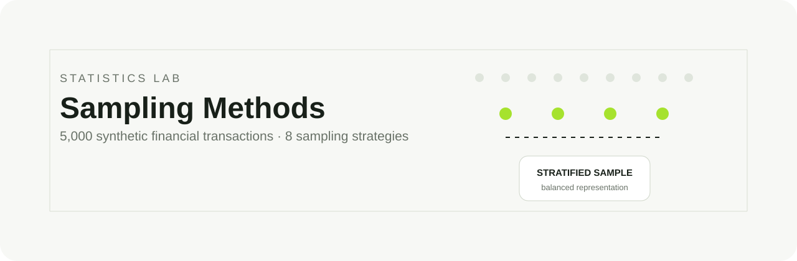

<p align="center">
  
</p>

<p align="center">
  
  
  
  
</p>

## Overview

A compact statistics lab that generates **5,000 synthetic financial transactions** and compares eight sampling strategies. The project shows how the sampling method changes representation, balance, and the conclusions drawn from data.

## Dataset

| Records | Regions | Transaction types | Fraud label |
|---:|---:|---:|---:|
| 5,000 | 6 | 3 | Binary |

## Methods explored

`simple random` · `systematic` · `stratified` · `judgment` · `cluster` · `convenience` · `quota` · `balanced fraud sample`

## What the experiment demonstrates

- Random sampling is unbiased in selection, but may underrepresent individual regions in a single draw.
- Stratified sampling guarantees controlled representation across locations.
- Judgment and convenience samples answer specific questions, but introduce selection bias.
- Balanced fraud/non-fraud samples are useful for comparison, though they no longer reflect the original class distribution.

## Run

```bash
python -m venv .venv
source .venv/bin/activate
pip install -r requirements.txt
python checkpoint.py
```

The script prints the mean transaction value and regional distribution for the random and stratified samples.

<p align="center"><sub>Built by <a href="https://github.com/guivital1">Guilherme Vital</a> · Statistics applied to data analysis</sub></p>
